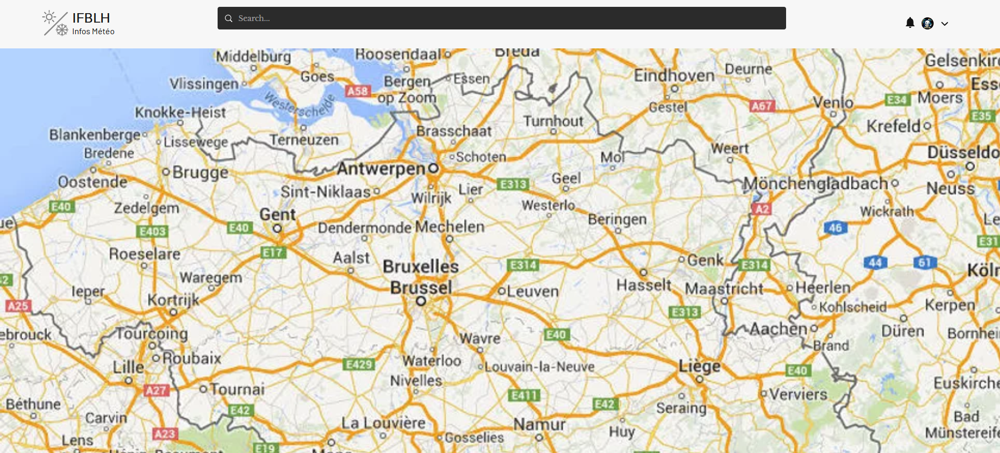
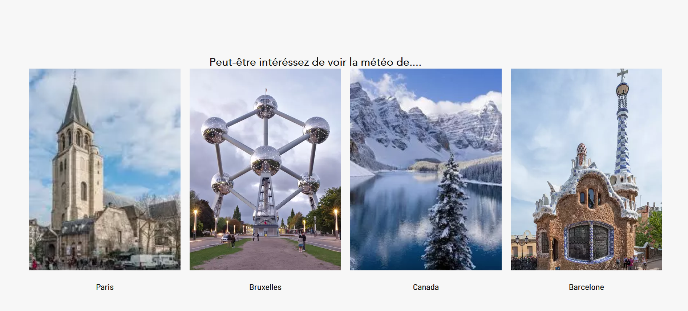

**LE SITE IFBLH**
==============================================================

INFOS PAGE D'ACCEUIL:
-----------------------------

#### screen 2.1:

La page d'acceuil acceuil une carte du monde qui permet à l'utilisateur de pouvoir choisir la ville ou l'on veut consulter la météo soit via la carte ou alors il peut ecrire sur la barre de recherche l'endroit souhaité. Une un pays séléctionné une fenêtre s'ouvrira ave des previsualisations de  **LIVE** d'utilisateurs qui viennent de la même ville en question.

#### screen 2.2:

Lorsque l'utilsateur scroll vers le bas il decouvre alors des suggestions de **LIVE** provenant de pays/ville autre qui sont populaire. Pour ainsi donner des informations supplémentaire sur la météo d'autres  